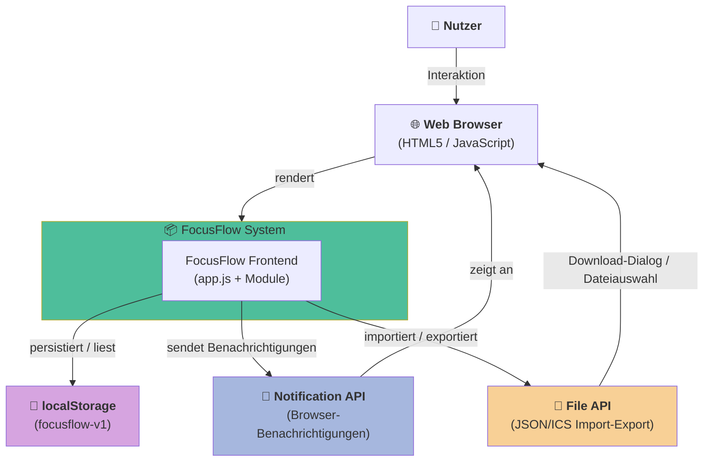
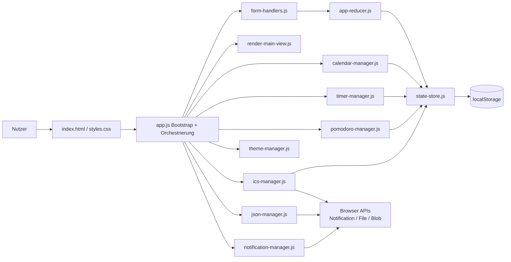
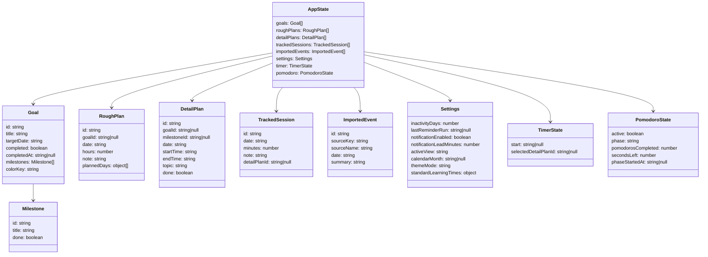

# Projekt: Lernzeit-Manager (FocusFlow)

Dieses Projekt entstand im Modul „Projekt Software Engineering (ISEF01)“ an der
IU Internationale Hochschule.

Der Lernzeit-Manager ist eine browserbasierte Webanwendung zur Planung, Organisation
und Nachverfolgung von Lernzeiten. Ziel ist es, Lernziele strukturiert zu planen,
Lernzeiten zu verteilen und den tatsächlichen Lernaufwand zu erfassen. 
Die Anwendung ist als Frontend-only-Prototyp umgesetzt und verzichtet bewusst auf
ein Backend oder eine Benutzerverwaltung.

## Features

- Lernziele mit Startdatum, abgeleitetem Enddatum, Workload, Farbe und Zwischenzielen
- Grobplanung auf Basis konfigurierbarer Standard-Lernzeiten
- Detailplanung aus Grobplanung sowie freie Zusatz-Detailplanung
- Lernzeit-Tracking per Stoppuhr, manueller Eintragung und Pomodoro
- Kalenderansicht fuer Ziele, Detailplanung und importierte ICS-Termine
- JSON- und ICS-Import/Export ueber das Menue
- Browser-Benachrichtigungen fuer geplante Lernzeiten
- Demo-Daten und Reset fuer schnelle Tests

## Systemüberblick

Anwendungstyp: Browserbasierte Web-App (Frontend-only) 
Persistenz: localStorage im Browser 
Deployment: GitHub Pages 
Zugriff: Direkt über Browser, keine Installation erforderlich 
Login: Nicht vorhanden

Die Anwendung wurde bis zur Abgabe iterativ weiterentwickelt und um
UI-/UX-Verbesserungen sowie zusätzliche Komfortfunktionen ergänzt,
ohne die fachlichen Zielsetzungen oder die Systemarchitektur zu verändern.

## Dokumentationen

MS4_Benutzerhandbuch_v1.0.pdf 
Beschreibung der Bedienung, Navigation und Kernfunktionen

MS4_Fachliche_Dokumentation_v1.0.pdf 
Funktionale Anforderungen, Use Cases, fachliche Regeln und Prozesse

MS4_TechnischeDokumentation_v1.0.pdf 
Architektur, Module, Datenhaltung, Berechnungslogik, Import/Export, CI/CD

MS4_Betriebsdokumentation_v1.0.pdf 
Systemzugriff, lokaler Start, Deployment, Betrieb, Konfiguration

MS4_Testabschlussbericht_v1.0.pdf 
Struktur, Teststrategie und Übersicht geplanter Tests (noch einzupflegen)

## Prozess- und Statusdokumente

Sprint0_Statusblatt.docx
Statusbericht zur Vorbereitung und technischen Initialisierung (Sprint 0)

Sprint1_Statusblatt.docx
Statusbericht zur Umsetzung der Kernfunktionen und Dokumentation (Sprint 1)

Zusätzlich liegt eine Sprint‑Planung zur Koordination der Testphase sowie ein Trello‑Board
zur operativen Aufgaben‑ und Fortschrittsverfolgung vor.

## GitHub

Repository-Link: `https://github.com/ChristinaSporer/FocusFlow` 
GitHub-Repository mit vollständiger Versionshistorie

## GitHub Pages

Bei erfolgreichem Default-Branch-Push werden App und Coverage bereitgestellt:

- App: `https://christinasporer.github.io/FocusFlow/`
- Coverage: `https://christinasporer.github.io/FocusFlow/coverage/`

Voraussetzung in GitHub:

- `Settings -> Pages -> Source: GitHub Actions`

## Lokaler Start

### Variante 1: npm

1. Abhaengigkeiten installieren:
   - `npm install`
2. App starten:
   - `npm start`
3. Aufrufen unter:
   - `http://localhost:8080/index.html`

### Variante 2: Windows One-Click

- `start-localhost.bat` per Doppelklick ausfuehren.
- Das Skript installiert bei Bedarf Abhaengigkeiten und startet den lokalen Server.

## Scripts

- `npm start`: Lokaler Server mit Auto-Open
- `npm run serve`: Lokaler Server ohne Auto-Open
- `npm run lint`: ESLint + Stylelint
- `npm run lint:fix`: Linting mit Auto-Fixes
- `npm run format`: Prettier Check
- `npm run format:write`: Prettier Write
- `npm run test`: Unit-/DOM-Tests (Vitest)
- `npm run test:coverage`: Unit-Tests mit Coverage
- `npm run test:watch`: Vitest Watch Mode
- `npm run test:e2e`: Playwright E2E
- `npm run test:all`: Unit + E2E

## Tests

- Unit-/DOM-Tests liegen unter `tests/unit`.
- E2E-Tests liegen unter `tests/e2e`.
- Die E2E-Testspezifikation liegt unter:
  - `tests/e2e/TESTSPEZIFIKATION.md`

## CI/CD (GitHub Actions)

Workflow: `.github/workflows/ci.yml`

Enthaelt folgende Jobs:

1. `lint`
   - ESLint, Stylelint, Prettier-Check
   - Hinweis: Job ist aktuell mit `continue-on-error: true` konfiguriert
2. `unit-tests`
   - Vitest mit Coverage
   - Artefakte: `coverage-report`, `unit-test-results`
3. `e2e-tests`
   - Playwright (Chromium)
   - Artefakte: `e2e-test-results`, bei Fehlern `playwright-traces`
4. `test-report`
   - Kombinierter Report aus Unit- und E2E-Ergebnissen
   - Artefakt: `ci-test-report`
5. `coverage-pages`
   - Deploy von App + Coverage auf GitHub Pages (nur Push auf Default-Branch)

## BESONDERE HINWEISE

Keine Test-Accounts erforderlich 
Die Anwendung besitzt keinen Login und keine Benutzerverwaltung.

Frontend-only-Architektur 
Es existiert keine serverseitige Persistenz oder Synchronisation.

### Datensicherung

Alle Daten werden lokal gespeichert. 
Für die Sicherung stehen JSON- und ICS-Exporte zur Verfügung.

## Architektur

Übersicht und Diagramme zur Architektur des Systems

### Kontextdiagramm (Systemgrenze und externe Schnittstellen)

### Kurzueberblick

- `app.js` initialisiert die Anwendung und orchestriert Rendering, Handler und Manager.
- Zustandsaenderungen laufen zentral ueber `form-handlers.js` -> `app-reducer.js` -> `state-store.js`.
- Der komplette App-Status wird nach jeder Aktion in `localStorage` persistiert.
- Fachmodule (`calendar-manager`, `timer-manager`, `pomodoro-manager`, `ics-manager`, `json-manager`, `notification-manager`) kapseln klar getrennte Verantwortlichkeiten.
- Die UI wird ueber `render-main-view.js` aus dem aktuellen Zustand neu aufgebaut.
- Import/Export und Benachrichtigungen nutzen Browser-APIs (File/Blob/Notification).
- Tests sind zweistufig aufgebaut: Vitest fuer Unit/DOM, Playwright fuer E2E.

### Komponentenuebersicht

### Datenmodell

