# FocusFlow

Ein einfacher Frontend-Prototyp (ohne Backend) für Lernzeitplanung und Lernzeit-Tracking.
Alle Daten werden im Browser über `localStorage` gespeichert.

## Enthaltene Funktionen

- Lernziele (Hauptziele) erfassen, als erreicht markieren
- Meilensteine/Detailplanung zu Zielen anlegen
- Kalenderansicht für Ziele, Detailplanung und ICS-Importe
- Übersicht aller kommenden Ziele und Detailplanungspunkte (scrollbar)
- Pomodoro-Technik mit Timer und Benachrichtigungen
- Stoppuhr für Lernzeit-Tracking
- Umfangreiche Demo-Daten per Button laden

## Lokaler Start

Da es statisches HTML/CSS/JS ist, kann `index.html` direkt im Browser geöffnet werden.
Für Browser-Benachrichtigungen bitte über `localhost` starten.

1. Abhängigkeiten installieren:

- `npm install`

2. Lokalen Server starten (öffnet automatisch im Standardbrowser):

- `npm start`

Standard-URL: `http://localhost:8080/index.html`

### One-Click Start (Windows)

Im Projekt liegt die Datei `start-localhost.bat`.
Diese Datei kann per Doppelklick gestartet werden und:

1. wechselt automatisch in den Projektordner,
2. führt bei Bedarf `npm install` aus,
3. startet die Anwendung mit `npm start` auf `localhost`.

## Code-Qualität (Lint/Format)

1. Abhängigkeiten installieren:
   - `npm install`
2. Linting ausführen:
   - `npm run lint`
   - `npm run lint:fix` (mit Auto-Fixes)
3. Formatting prüfen/anwenden:
   - `npm run format`
   - `npm run format:write`

## Automatische Tests

1. Test-Dependencies installieren:
   - `npm install`
2. Unit-/DOM-Tests (Vitest):
   - `npm run test`
   - `npm run test:watch`
3. End-to-End-Test (Playwright):
   - `npm run test:e2e`
4. Alles zusammen:
   - `npm run test:all`
5. Coverage Test:
   - `npm run test:coverage`

## Continuous Integration (CI)

Bei jedem Commit / Push wird automatisch eine GitHub Actions Workflow ausgeführt, die:

- **Lint & Format**: ESLint, Stylelint und Prettier-Check
- **Unit Tests**: Vitest mit Coverage-Bericht
- **E2E Tests**: Playwright-Tests

**Coverage-Report ansehen (GitHub Pages):**

Der Coverage-Report wird nach jedem erfolgreichen Run auf der `main`-Branch automatisch zu GitHub Pages deployed:

1. Gehe zu deinem **GitHub Pages** (z.B. `https://ChristinaSporer.github.io/FocusFlow/`)
2. Öffne den **Coverage-Report** unter: `/coverage/index.html`
3. Oder direkt:
   ```
   https://<dein-username>.github.io/FocusFlow/coverage/index.html
   ```

**Einmalige Aktivierung (falls noch nicht geschehen):**
- Gehe in GitHub → **Settings → Pages**
- Source: **Deploy from a branch**
- Branch: `gh-pages`, Folder: `/ (root)`
- Der Workflow erstellt die `gh-pages` Branch automatisch beim ersten erfolgreichen Push auf `main`

## GitHub Pages Deployment

1. Repository auf GitHub erstellen und Dateien pushen.
2. In GitHub: `Settings > Pages` öffnen.
3. Source: `Deploy from a branch`.
4. Branch: `main` (oder `master`), Folder: `/ (root)`.
5. Speichern, dann wird eine Pages-URL bereitgestellt.

## Hinweise

- Browser-Benachrichtigungen für Pomodoro müssen einmal erlaubt werden.
- Für einen echten Produktivbetrieb wären Benutzerkonten, serverseitige Persistenz und Synchronisation sinnvoll.

## Komponentendiagramm

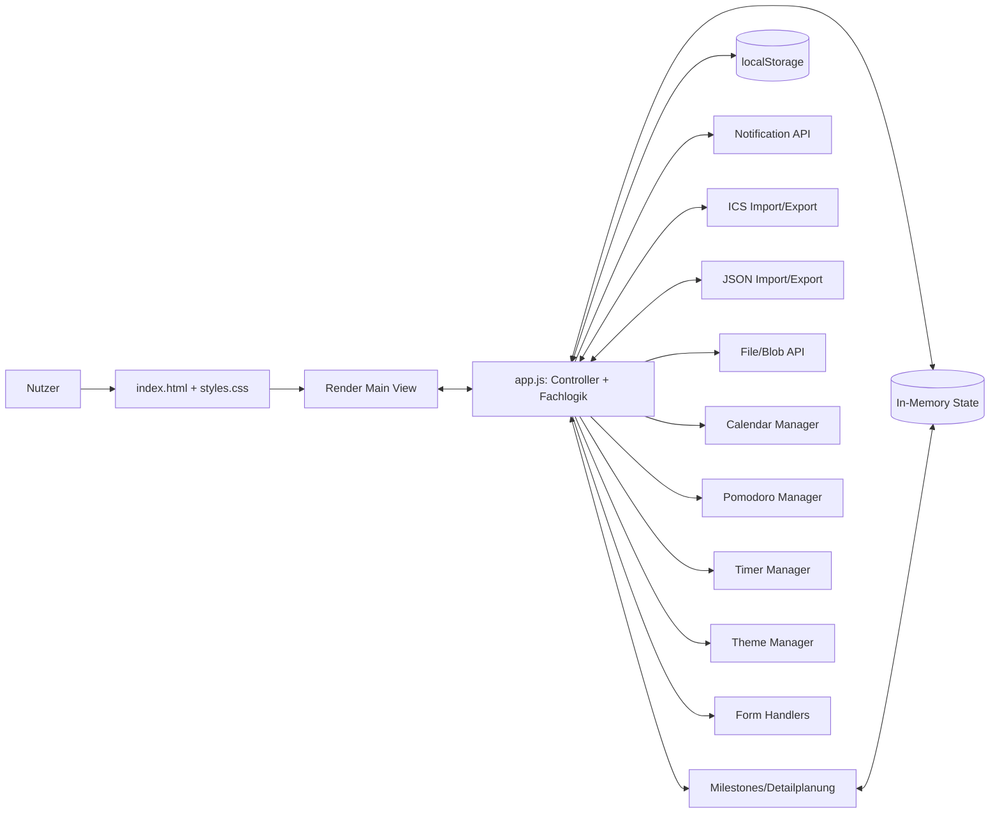

## Klassendiagramm

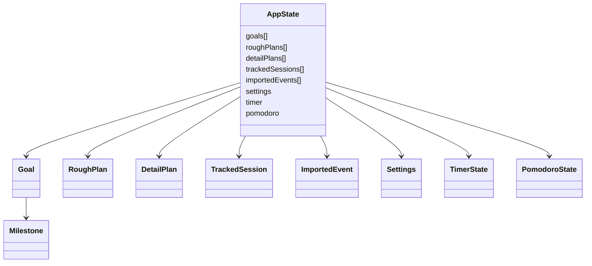

## Sequenzdiagramme

### Ziel anlegen

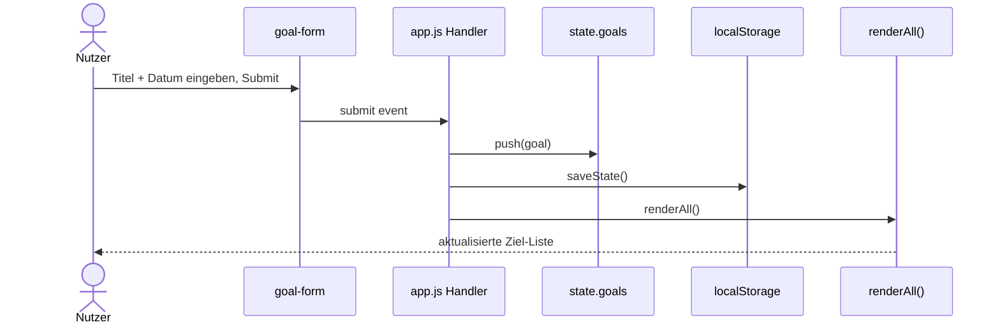

### Zwischenziel (Milestone) anlegen

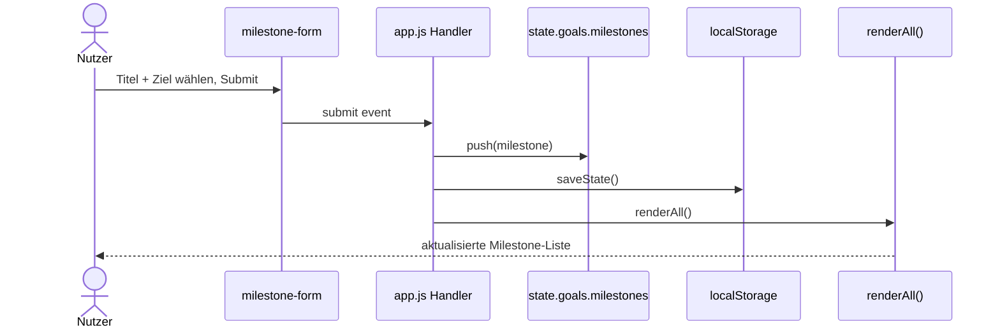

### Grobplanung erstellen

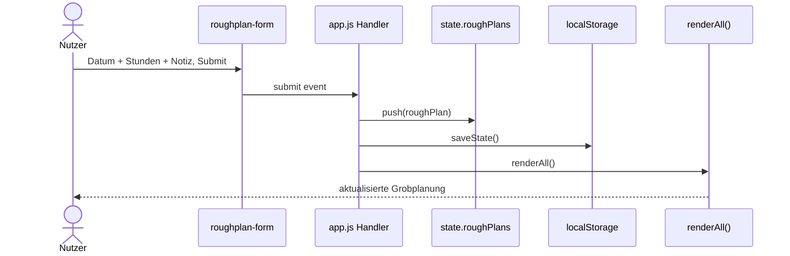

### Detailplanung erstellen

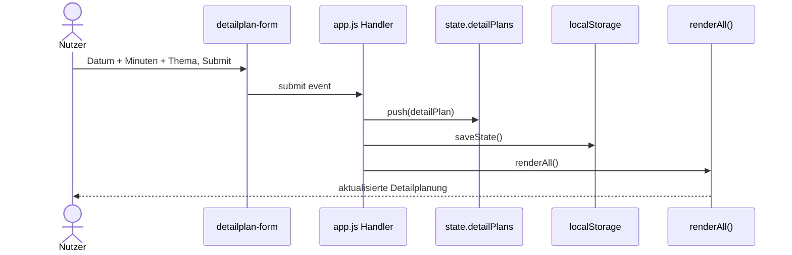

### Stoppuhr starten und speichern

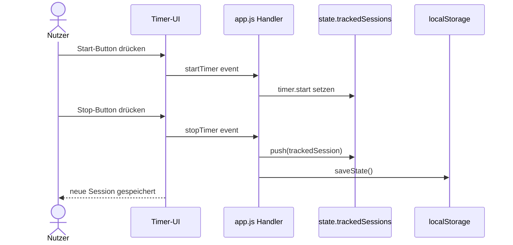

### Pomodoro starten und abschließen

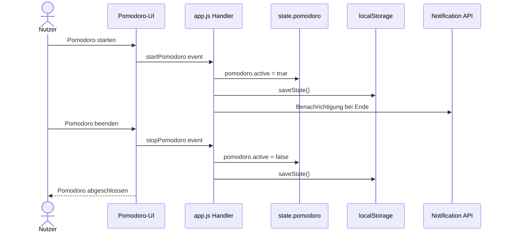

### Zeit manuell eintragen

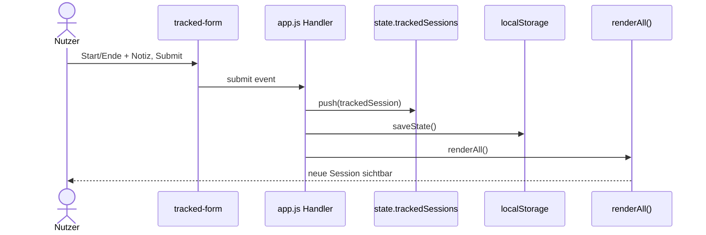

## Klassendiagramm: Datenmodell

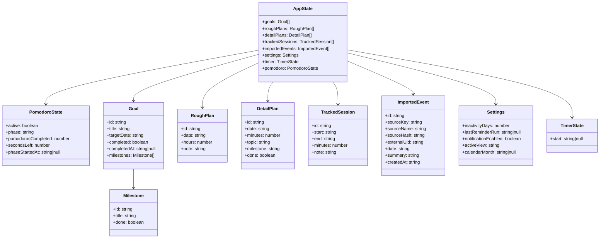

## Use-Case Diagramm

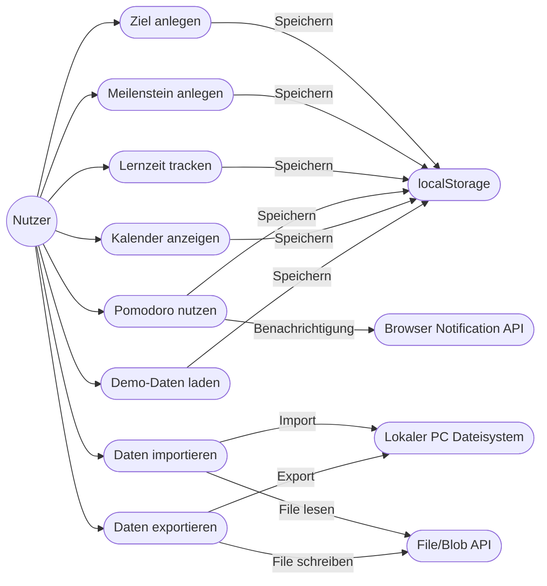

## Zustandsdiagramm Pomodoro Technik

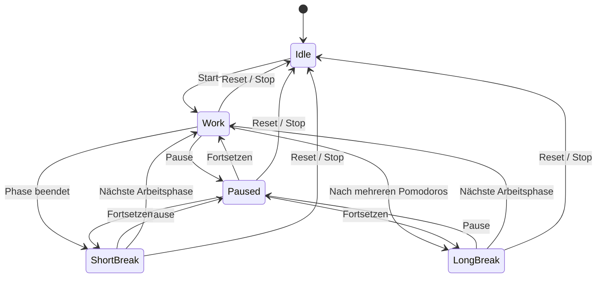

## Kontextdiagramm

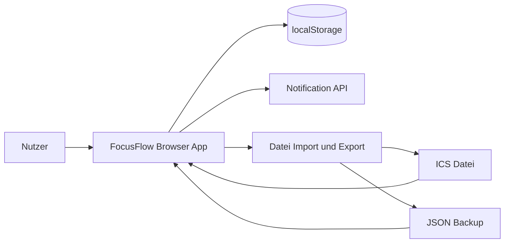

## Komponentendiagramm

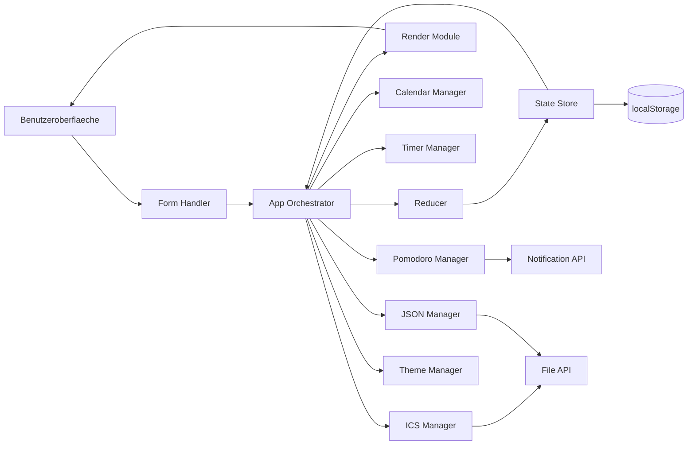

## Datenmodell

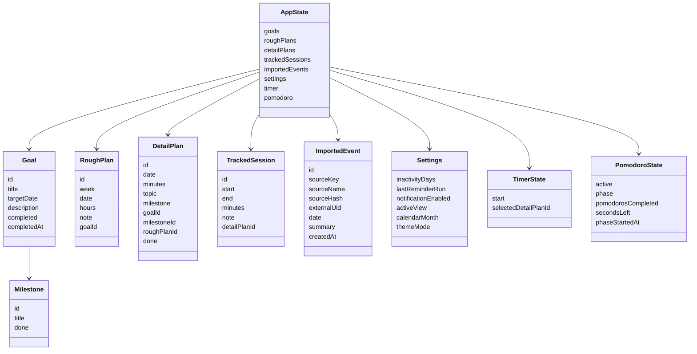

## Sequenzdiagramm Standard Use-Case

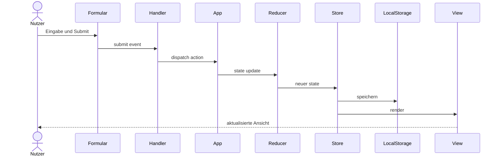

## Sequenzdiagramm Import-Flow

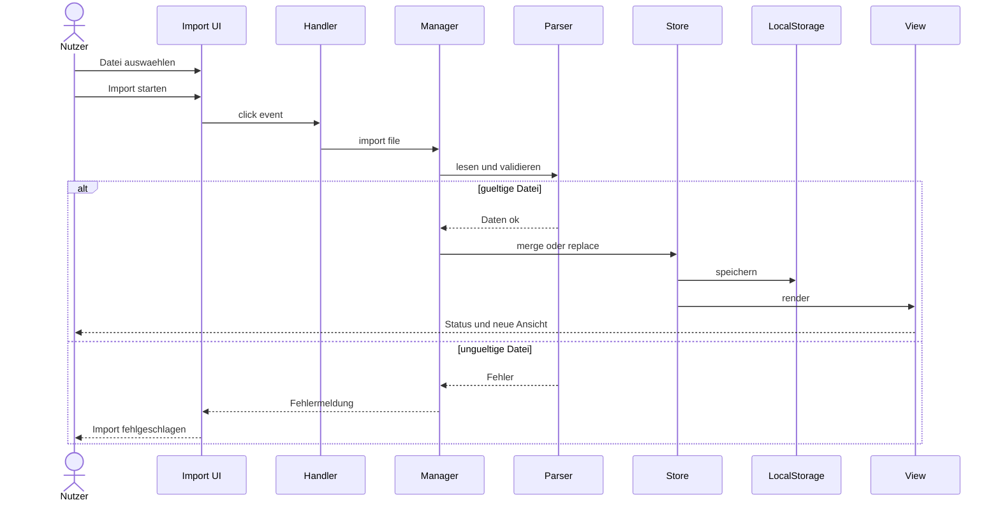
